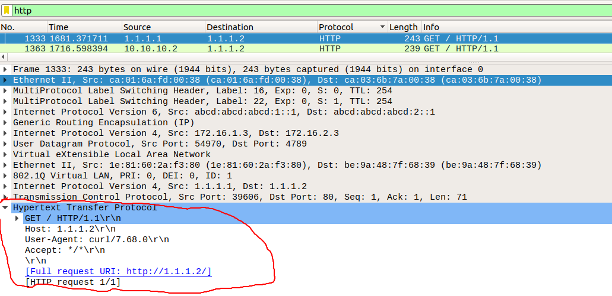

# Overloading Encapsulation with VXLAN by Extending Broadcast domain to remote branch over  MPLS/VPN6 BackBone  
(Reboot with my precedent **VXLAN** project with more details and some improvements).

So ! First question ! Why **WAYNE  ENTREPRISE** ? 
Obvisiouly 'cause i'm DCU Comics fan and ...

#### Software Requirements :


> * GNS3 ( FOR MPLS/VPN6 BACKBONE ) 
> * VMare Workstatio Pro ( For simulate distributed network )
> * Wireshark
> * Docker Container 
> * Ubuntu server 
> * OpenVSwitch 

#### Underlay Topology : 


#### Overlay Topology : 


## So let's go !!! 

### MPLS/VPN6 Deployement :

 ! Find all router config scripts and Addressing Table in "CiscoStartupConfigRouters/" directory 
 
 > > >  > ASSUME THAT YOU HAVE ALREADY YOUR MPLS BACKBONE !!!
 
##  1) STEP 1 : 
 
 Check if HQ(172.16.1.3) and Branch(172.16.2.3) can talk and Check if flows travel through MPLS/VPN6 BACKBONE
 
 
 
 * 1 Reply from **Branch** to **HQ**
 * 2 Label Tag 
 
## 2) STEP 2 : 

- Building of LAN infrastructure on HQ : 

    * Setup Bridge instance "switch" ( OpenVSwitch instance ) : 
	
    > ` hq# ovs-vsctl add-br switch `
	
    * Setup Nginx Web server "webserver"  ( docker container instances ) :
	
    > ` hq# docker run --name webserver --net none -P -d ultron11/nginx  `
	
    * Setup VLANs interfaces on bridge instance as gateway ( vlan1 : 10.10.10.0/24 and vlan2 : 10.1020.0/24 ) :
    
    > ` hq# ovs-vsctl add-port switch vlan10 tag=10 -- set interface vlan10 type=internal`
    > ` hq# ovs-vsctl add-port switch vlan20 tag=20 -- set interface vlan20 type=internal`
    
    * Setup link between "switch" and "webserver" ( 1.1.1.0/30) :
    
    > ` hq# ovs-vsctl add-port switch vlan1 tag=1 -- set interface vlan1 type=internal`
    
    * Configuration of VLAN1 interface in netplan file.
    * Setup web server on the link :
    
    > ` hq# ovs-docker add-port switch eth1 webserver --ipaddress=1.1.1.2/24 --gateway=1.1.1.1`
    > ` hq# ovs-docker set-vlan switch eth1 webserver 1`
	
	
## CHECKING ! 
	 
- ip addresses configuration on 'switch' :
	 
> ` hq# ip add `
   
output :
   
``` 
   18: vlan10: <BROADCAST,MULTICAST,UP,LOWER_UP> mtu 1500 qdisc noqueue state UNKNOWN group default qlen 1000
           link/ether a2:df:3d:8b:74:6c brd ff:ff:ff:ff:ff:ff
           inet 10.10.10.1/24 brd 10.10.10.255 scope global vlan10
               valid_lft forever preferred_lft forever
           inet6 fe80::a0df:3dff:fe8b:746c/64 scope link 
               valid_lft forever preferred_lft forever
       19: vlan20: <BROADCAST,MULTICAST,UP,LOWER_UP> mtu 1500 qdisc noqueue state UNKNOWN group default qlen 1000
           link/ether c6:92:23:07:86:a7 brd ff:ff:ff:ff:ff:ff
           inet 10.10.20.1/24 brd 10.10.20.255 scope global vlan20
               valid_lft forever preferred_lft forever
           inet6 fe80::c492:23ff:fe07:86a7/64 scope link 
               valid_lft forever preferred_lft forever
       20: vlan1: <BROADCAST,MULTICAST,UP,LOWER_UP> mtu 1500 qdisc noqueue state UNKNOWN group default qlen 1000
           link/ether 1e:81:60:2a:f3:80 brd ff:ff:ff:ff:ff:ff
           inet 1.1.1.1/24 brd 1.1.1.255 scope global vlan1
               valid_lft forever preferred_lft forever
           inet6 fe80::1c81:60ff:fe2a:f380/64 scope link 
               valid_lft forever preferred_lft forever 
	       
```

- OpenVSwitch show result :
       
> ` hq# show ovs-vsctl show `
       
output :
       
``` 
5d1e1cf-ac2d-42c2-8cf3-bb4d33410d06
    Bridge switch
        Port vlan10
            tag: 10
            Interface vlan10
                type: internal
        Port switch
            Interface switch
                type: internal
        Port vlan1
            tag: 1
            Interface vlan1
                type: internal
        Port vlan20
            tag: 20
            Interface vlan20
                type: internal
    ovs_version: "2.13.0"
    
```

	
	
- OpenVSwitch list ports result : 
	
> ` hq# ovs-vsctl list-ports ` 
	
output :
	
``` 
    vlan1
    vlan10
    vlan20 
```

- Docker Container list instances : 
        
 > ` hq# docker ps ` 
        
 output :
        
``` 
CONTAINER ID        IMAGE                 COMMAND                  CREATED             STATUS              PORTS                                            NAMES
fd48f573b88a        ultron/nginx          "/docker-entrypoint.…"   12 minutes ago      Up 12 minutes             

```


- Building of LAN infrastructure on Branch : 
        
* Setup Bridge instance "switch" ( OpenVSwitch instance ) :

> ` branch# ovs-vsctl add-br switch `

* Setup client1,client2, client2 and client4 ( docker container instances ) :
        
> ` branch# docker run -it --name client1 --net none gns3/ipterm`
> ` branch# exit`
> ` branch# docker run -it --name client2 --net none gns3/ipterm`
> ` branch# exit`
> ` branch# docker run -it --name client3 --net none gns3/ipterm`
> ` branch# exit`
> ` branch# docker run -it --name client4 --net none gns3/ipterm`
> ` branch# exit`
> ` branch# docker start client1 client2 client3 client4 `
    
* Attach client1 et client2 to vlan 10 and address assignement : 
    
> ` branch# ovs-docker add-port switch eth1 client1 --ipaddress=10.10.10.2/24 --gateway=10.10.10.1`
> ` branch# ovs-docker set-vlan switch eth1 client1 10`
> ` branch# ovs-docker add-port switch eth1 client2 --ipaddress=10.10.10.3/24 --gateway=10.10.10.1`
> ` branch# ovs-docker set-vlan switch eth1 client2 10`
       
* Attach client3 et client4 to vlan 20 and address assignement : 
    
> ` branch# ovs-docker add-port switch eth1 client3 --ipaddress=10.10.20.2/24 --gateway=10.10.20.1`
> ` branch# ovs-docker set-vlan switch eth1 client3 20`
> ` branch# ovs-docker add-port switch eth1 client4 --ipaddress=10.10.20.3/24 --gateway=10.10.20.1`
> ` branch# ovs-docker set-vlan switch eth1 client4 20`
       

## CHECKING ! 

If docker container instances are up : 
   
> ` branch# docker ps`
   
output : 
   
``` 
CONTAINER ID        IMAGE                 COMMAND                  CREATED             STATUS              PORTS              NAMES
8913de0d2430        gns3/ipterm           "sh -c 'cd; exec bas…"   5 minutes ago       Up 5 minutes                              client4
e32d6838c472        gns3/ipterm           "sh -c 'cd; exec bas…"   5 minutes ago       Up 5 minutes                              client3
26350bbfe178        gns3/ipterm           "sh -c 'cd; exec bas…"   6 minutes ago       Up 5 minutes                              client2
0f5ca9c1cb34        gns3/ipterm           "sh -c 'cd; exec bas…"   9 minutes ago       Up 5 minutes                              client1 
```

If vlan10 broadcast domain works ( client1 ping client2 ) : 

> ` branch# docker exec -it client1 bash` 
   
> ` client1# ping -c4 10.10.10.3`
     
output : 
    
      PING 10.10.10.3 (10.10.10.3) 56(84) bytes of data.
      64 bytes from 10.10.10.3: icmp_seq=1 ttl=64 time=2.22 ms
      64 bytes from 10.10.10.3: icmp_seq=2 ttl=64 time=0.132 ms
      64 bytes from 10.10.10.3: icmp_seq=3 ttl=64 time=0.126 ms
      64 bytes from 10.10.10.3: icmp_seq=4 ttl=64 time=0.249 ms

           --- 10.10.10.3 ping statistics ---
      4 packets transmitted, 4 received, 0% packet loss, time 3043ms
      rtt min/avg/max/mdev = 0.126/0.681/2.220/0.890 ms
 
 
If remote routing works ( client1 ping client4 ):
   
> `client# ping -c4 10.10.20.3`
       
output : 
   
      PING 10.10.20.3 (10.10.20.3) 56(84) bytes of data.
       From 10.10.10.2 icmp_seq=1 Destination Host Unreachable
       From 10.10.10.2 icmp_seq=2 Destination Host Unreachable
       From 10.10.10.2 icmp_seq=3 Destination Host Unreachable
       From 10.10.10.2 icmp_seq=4 Destination Host Unreachable

             --- 10.10.20.3 ping statistics ---
     4 packets transmitted, 0 received, +4 errors, 100% packet loss, time 3074ms
     pipe 4
   
  
Ports connected to th switch : 
    
> ` branch# ovs-vsctl list-ports switch` 
    
output : 

	7d8dc0e0b8a94_l
	b79e5c6d4ba74_l
	cfd7366b9d094_l
	d598773a8d824_l

    
Show command 'switch' :
  
> `branch# ovs-vsctl show`
   
output :
  
    5d1e1cf-ac2d-42c2-8cf3-bb4d33410d06
    Bridge switch
        Port "7d8dc0e0b8a94_l"
            tag: 10
            Interface "7d8dc0e0b8a94_l"
        Port cfd7366b9d094_l
            tag: 20
            Interface cfd7366b9d094_l
        Port d598773a8d824_l
            tag: 10
            Interface d598773a8d824_l
        Port b79e5c6d4ba74_l
            tag: 20
            Interface b79e5c6d4ba74_l
        Port switch
            Interface switch
                type: internal
                
        ovs_version: "2.13.0"
  
  
## 3) STEP 3 :   

- Setup VXLAN tunnel 
                        "HQ ---------------- Branch" 
                        
> `hq# ovs-vsctl add-port switch vx1 -- set interface vx1 type=vxlan options:remote_ip=172.16.2.3 `
   
>`branch# ovs-vsctl add-port switch vx1 -- set interface vx1 type=vxlan options:remote_ip=172.16.1.3`
   
## CHECK ! 

Show command 'switch' : 
   
> `branch# ovs-vsctl show `
   
output :
   
    95d1e1cf-ac2d-42c2-8cf3-bb4d33410d06
    Bridge switch
        Port "7d8dc0e0b8a94_l"
            tag: 10
            Interface "7d8dc0e0b8a94_l"
        Port vx1
            Interface vx1
                type: vxlan
                options: {remote_ip="172.16.1.3"}
        Port cfd7366b9d094_l
            tag: 20
            Interface cfd7366b9d094_l
        Port d598773a8d824_l
            tag: 10
            Interface d598773a8d824_l
        Port b79e5c6d4ba74_l
            tag: 20
            Interface b79e5c6d4ba74_l
        Port switch
            Interface switch
                type: internal
    ovs_version: "2.13.0"
    
    
- Checking VXLAN tunnel ( client1 ping VLAN10 interfaces and client2 ping VLAN20 interfaces ) in below video
- Checking Overlay Routing ( Client1 in VLAN10 ping client2 in VLAN20 ) in below video 
- http request from client1 to webserver and checking Overloading Encapsulation :

> `client1# curl http://1.1.1.2 `
   
Wireshark capture : 
   


### OMG !!! 14 encapsulations, Big concequence on QoS 
   
 
## Demonstration :


   
[](http://www.youtube.com/watch?v=QQhysH0IN58 "Overloading Encapsulation with VXLAN, IPsec, MPLS/VPN6, GNS3, StrongSwan, ubuntu server (Part. I)")


In next post i gonna show how to encrypt all of this with IPsec ESP using StrongSwan !!!


