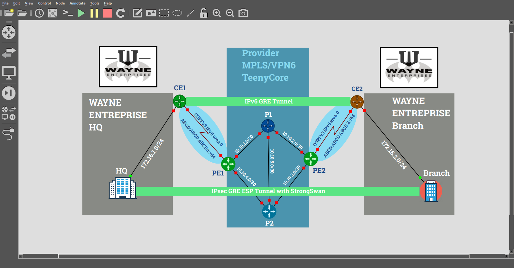
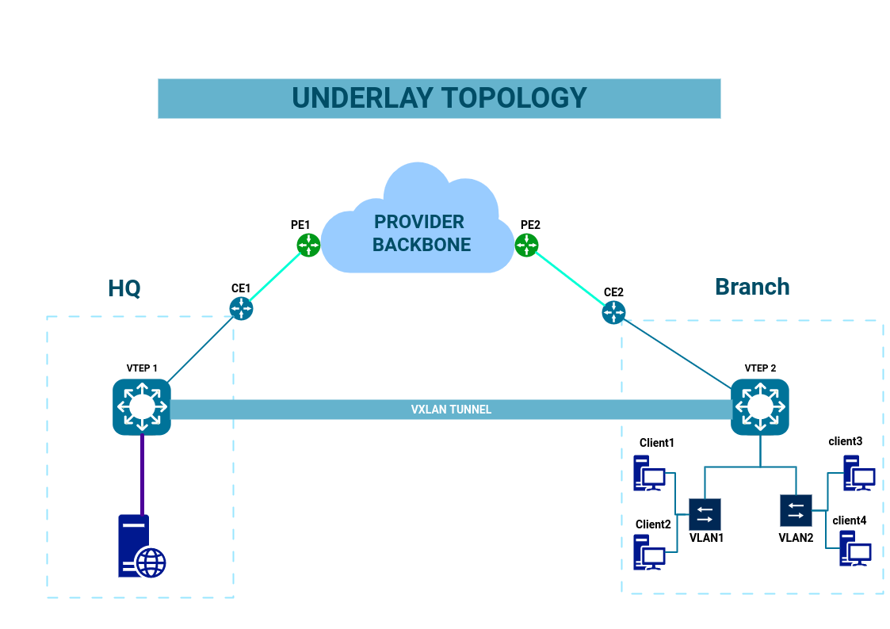
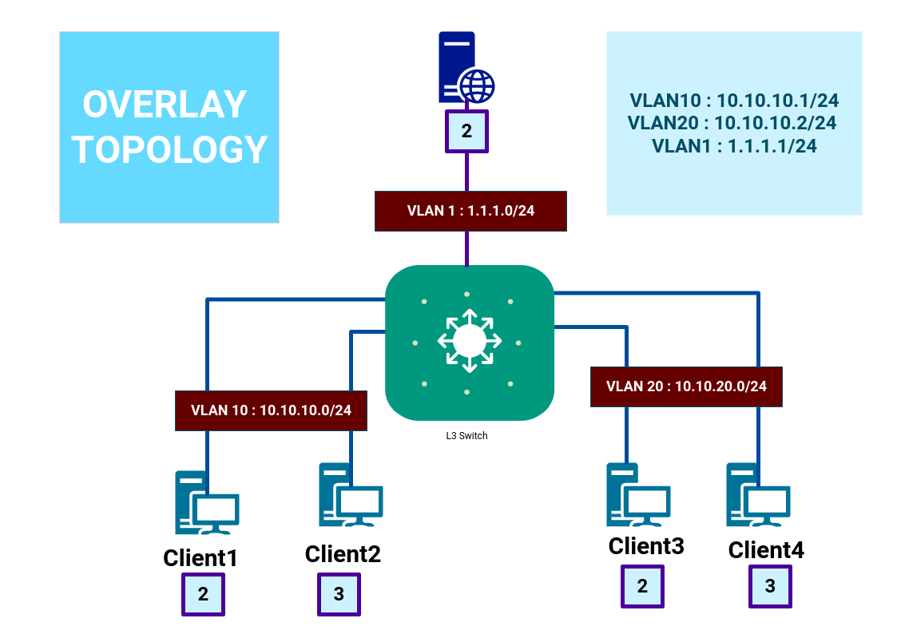
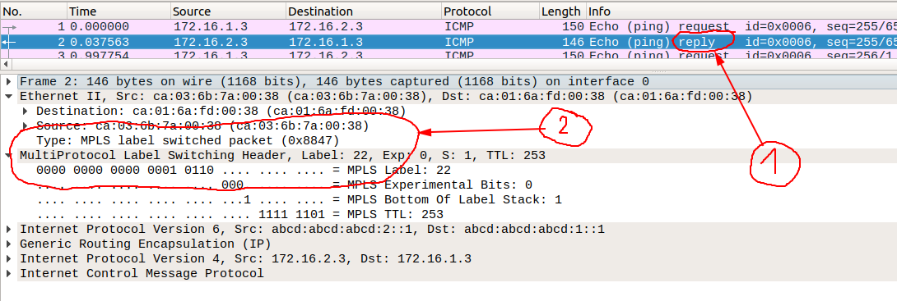

# Overloading Encapsulation with VXLAN by Extending Broadcast domain to remote branch over  MPLS/VPNv6 BackBone  
(Reboot with my precedent **VXLAN** project with more details and some improvements).

So ! First question ! Why **WAYNE  ENTREPRISE** ? 
Obvisiouly 'cause i'm DCU Comics fan and ...

#### Software Requirements :

> * GNS3 ( FOR MPLS/VPN6 BACKBONE ) 
> * VMare Workstatio Pro ( For simulate distributed network )
> * Wireshark
> * Docker Container 
> * Ubuntu server 
> * OpenVSwitch 

#### Underlay Topology : 

#### Overlay Topology : 

## So let's go !!! 

### MPLS/VPN6 Deployement :

 ! Find all router config scripts and Addressing Table in "CiscoStartupConfigRouters/" directory 
 
 > > >  > ASSUME THAT YOU HAVE ALREADY YOUR MPLS BACKBONE !!!
 
##  ** 1) STEP 1 : **
 
 Check if HQ(172.16.1.3) and Branch(172.16.2.3) can talk and Check if flows travel through MPLS/VPN6 BACKBONE
 
 
 
 * 1 Reply from **Branch** to **HQ**
 * 2 Label Tag 
 
## 2) STEP 2 : 

- Building of LAN infrastructure on HQ : 

	* Setup Bridge instance "switch" ( OpenVSwitch instance ) : 
	
	> ` # ovs-vsctl add-br switch `
	
	* Setup Nginx Web server "webserver"  ( docker container instances ) :
	
	> ` # docker run --name webserver --net none -P -d ultron11/nginx  `
	
	* Setup VLANs interfaces on bridge instance as gateway ( vlan1 : 10.10.10.0/24 and vlan2 : 10.1020.0/24 ) :
	> ` # ovs-vsctl add-port switch vlan10 tag=10 -- set interface vlan10 type=internal`
	> ` # ovs-vsctl add-port switch vlan20 tag=20 -- set interface vlan20 type=internal`
	* Setup link between "switch" and "webserver" ( 1.1.1.0/30) :
	> ` # ovs-vsctl add-port switch vlan1 tag=1 -- set interface vlan1 type=internal`
	* Configuration of VLAN1 interface in netplan file.
	* Setup web server on the link : 
	` # ovs-docker add-port switch eth1 webserver --ipaddress=1.1.1.2/24 --gateway=1.1.1.1`
	` # ovs-docker set-vlan switch eth1 webserver 1`
	
	CHECKING ! 
	 
	 - ip addresses configuration on 'switch' :

	
	
	

 
  
 
 
 

 

 
